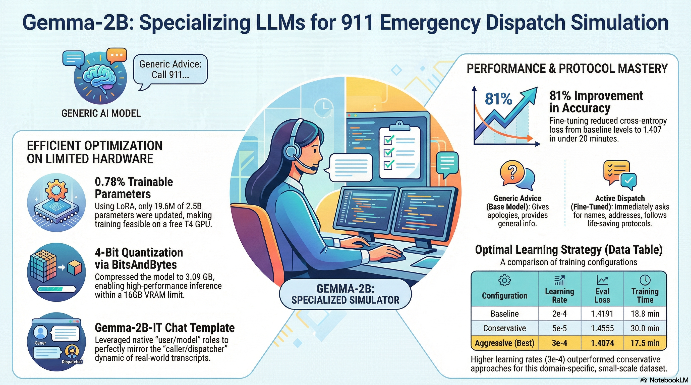

# 🚨 Fine-Tuning for 911 Emergency Dispatch Simulation

A fine-tuned AI model that simulates professional 911 emergency dispatcher communication protocols, built by specializing Google's Gemma-2B-IT using LoRA and 4-bit quantization on real emergency call transcripts.

> ⚠️ **Disclaimer:** This project is strictly an **educational and research tool** for dispatcher training. It is **not intended for use in live emergency contexts**.



## 🔗 Links

- **[Live Demo(HuggingFace Space)](https://huggingface.co/spaces/Dotbix/911-emergency-operator)**
- **[Video Walkthrough](https://drive.google.com/file/d/1FQ6lCXb9tbL2G1zK9_FgRDp74JINQ1Pu/view?usp=sharing)**
- **[AI Explainer Video](https://drive.google.com/file/d/1P-0IF3yioxr7nw6lB_v2kOPKeOcc0XOt/view?usp=sharing)**

---

## Executive Summary

General-purpose LLMs lack the highly structured, urgent communication style required for emergency dispatch. This project fine-tunes Gemma-2B-IT on 518 real 911 call transcripts to bridge that gap, achieving an **81% improvement in cross-entropy loss** over the base model while training in under 20 minutes on consumer-grade hardware.

### Key Results

| Metric | Value |
|---|---|
| Loss Improvement | 81% (7.35 → 1.40) |
| Best Configuration | Aggressive (LR: 3e-4, 3 epochs) |
| Trainable Parameters | 19.6M (0.78% of total) |
| Training Time | ~17.5 minutes |
| Hardware | Tesla T4 GPU (free-tier) |

---

## Dataset

**Source:** [`spikecodes/911-call-transcripts`](https://huggingface.co/datasets/spikecodes/911-call-transcripts) on Hugging Face

- **518** real-world emergency call transcripts
- **Scenarios:** Active shooters, stabbings, vehicle break-ins, medical crises, and more
- **Structure:** Multi-turn conversations (~50 turns/call avg)
- **Preprocessing:** Merged consecutive same-role messages, removed null values, formatted into Gemma's native chat template

---

## Technical Stack

| Component | Details |
|---|---|
| **Base Model** | Google Gemma-2B-IT |
| **Quantization** | 4-bit (BitsAndBytes, NF4 + double quantization) → ~3.09 GB footprint |
| **Fine-Tuning** | LoRA (r=16, α=32) targeting q, k, v, o, gate, up, down projections |
| **Optimizer** | `paged_adamw_8bit` |
| **Precision** | FP16 mixed precision |
| **Framework** | Hugging Face Transformers + PEFT |

---

## Experimental Results

Three hyperparameter configurations were compared:

| Configuration | Learning Rate | Epochs | Train Loss | Eval Loss | Runtime |
|---|---|---|---|---|---|
| Baseline | 2e-4 | 3 | 2.0198 | 1.4191 | 18.8 min |
| Conservative | 5e-5 | 5 | 2.3187 | 1.4555 | 30.0 min |
| **Aggressive** ✅ | **3e-4** | **3** | **1.8619** | **1.4074** | **17.5 min** |

**Finding:** Higher learning rates converged faster and more effectively. The small dataset required more significant weight updates in fewer passes to capture domain-specific patterns.

---

## Base Model vs. Fine-Tuned Model

### ❌ Base Model Issues
- **Generic refusals:** *"I'm not able to provide advice related to dangerous situations."*
- **Circular logic:** Advised callers to "call 911 immediately" — despite already being on a 911 call
- **Disclaimer overload:** Frequently stated it could not offer medical advice

### ✅ Fine-Tuned Model Improvements
- **Immediate protocol adherence:** Establishes location and caller identity first
- **Reassurance:** Uses phrases like *"I'm going to get some help to you"* and *"Stay on the line with me"*
- **Active information gathering:** Asks about injuries, suspect descriptions, and specific locations

---

## Known Limitations

- **Token truncation:** 512-token max sequence length means longer calls (~50 turns) may be cut off
- **Synthetic artifacts:** Placeholder messages (e.g., `"Caller: [listening]"`) inserted to maintain strict user/model turn alternation may create unnatural patterns
- **No multi-agency simulation:** Does not model call transfers between police, fire, and medical agencies

---

## Future Work

- Add **BLEU/ROUGE scores** for quantitative generation evaluation
- Implement a **formal error categorization system** for protocol adherence
- Expand **context window beyond 512 tokens** to capture full call evolution
- Train on **larger and more diverse datasets**

---

## Getting Started

### Prerequisites

```bash
pip install transformers peft bitsandbytes datasets accelerate
```

### Quick Start

```python
from transformers import AutoModelForCausalLM, AutoTokenizer
from peft import PeftModel

# Load base model with quantization
model = AutoModelForCausalLM.from_pretrained(
    "google/gemma-2b-it",
    quantization_config=bnb_config,
    device_map="auto"
)

# Load fine-tuned LoRA adapter
model = PeftModel.from_pretrained(model, "path/to/lora-adapter")
tokenizer = AutoTokenizer.from_pretrained("google/gemma-2b-it")
```

---

## Project Structure

```
├── ai_911_operator.ipynb    # Training notebook
├── README.md
└── requirements.txt
```

---

## Acknowledgments

- Dataset: [spikecodes/911-call-transcripts](https://huggingface.co/datasets/spikecodes/911-call-transcripts)
- Base Model: [Google Gemma-2B-IT](https://huggingface.co/google/gemma-2b-it)
- Built with [Hugging Face](https://huggingface.co/) ecosystem (Transformers, PEFT, BitsAndBytes)
